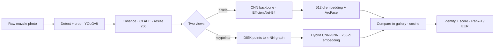
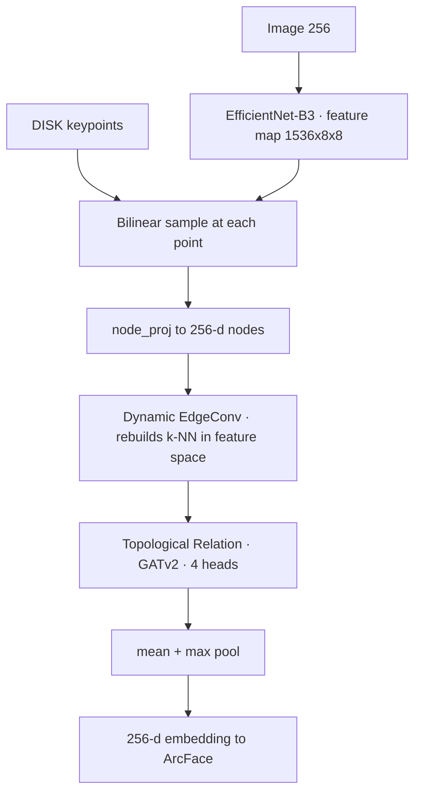

# Architecture & Results Guide — Cattle Muzzle Biometrics

A file-by-file, function-by-function tour of the pipeline, the maths behind each
model, and an honest reading of the results. A visual version of this guide is
also published as an interactive page (see the project's Artifacts).

> **One-line thesis:** the CNN's raw-texture reading dominates *ranking* (who is
> this?), while the graph branch adds a small but real *verification* refinement
> (is this really them?). Much of the code exists to establish that claim rigorously.

---

## 1. The 30-second picture

Given a photo of a cow's muzzle — a fingerprint-like pattern of "beads" and
"valleys" — identify which of 260 known animals it is. Each image becomes a
compact numeric **embedding**; identity = the nearest known embedding (cosine).



| Metric | Value |
|---|---|
| Animals / images | 260 / 4,891 |
| CNN Rank-1 | 95.4% |
| CNN+Hybrid ensemble | 96.1% Rank-1, 0.78% EER |
| Zero-shot on 308 unseen animals | 87.0% Rank-1 (no fine-tuning) |

---

## 2. Repository map

The code splits into a reusable library (`src/`) and runnable entry points
(`scripts/`). This guide documents the **core** that produces the final results;
~40 exploratory scripts (older GNN variants, SuperPoint/LightGlue matchers) are
scaffolding and are noted but not detailed.

| Subsystem | Where | Job |
|---|---|---|
| Data pipeline | `scripts/01–04`, `src/preprocessing` | download → crop → enhance → keypoints → graphs |
| Features | `src/features/graph_builder.py` | keypoints → k-NN graph with geometric edges |
| Models | `src/models/*` | CNN+ArcFace, Hybrid CNN-GNN, ProtoN, pure GNNs |
| Training | `src/training/*`, `scripts/train_*` | datasets, samplers, loss, optimisation |
| Evaluation | `src/evaluation/*` | Rank-1/EER/CMC, open-set, calibration, corruptions |
| Explainability | `src/models/explainability.py`, `src/evaluation/faithfulness.py` | Grad-CAM, attention, causal faithfulness |
| Extension study | `scripts/experiment_*.py` | quality-aware fusion + 3-stage causal protocol |

---

## 3. Pipeline, file by file

### 3.1 Data & preprocessing
- **`scripts/01_download_data.py` → `04_build_graphs.py`** — the reproducible
  pipeline: fetch Zenodo → CLAHE + resize → DISK keypoints → k-NN graphs saved as
  `{train,val,test}_graphs.pt`.
- **`src/preprocessing/enhancement.py`** — CLAHE contrast enhancement. Applied
  identically at train *and* test time (critical for cross-dataset transfer).
- **`scripts/muzzle_detector.py`** — YOLOv8n muzzle detector (val mAP@50 = 0.995).
  `train(args)` fine-tunes it; `crop(args)` extracts the muzzle from wide farm
  scenes. Doubles as the deployment front-end.

### 3.2 Keypoints & graph construction
- **`src/features/superpoint.py`** — learned keypoint detector wrapper
  (Kornia-**DISK**, chosen over SIFT). Per image: ≤128 points `(x,y)` + 256-d
  descriptors + scores.
- **`src/features/graph_builder.py`** — `GraphBuilder`:

  | Method | In → Out | What it does |
  |---|---|---|
  | `build_graph()` | keypoints, descriptors, scores → `Data(x, pos, edge_index, edge_attr)` | connects each node to its k=8–12 nearest neighbours in image space; normalises positions; computes edge attributes |
  | `visualize_graph()` | image, Data → PNG | draws nodes+edges over the muzzle |
  | `get_stats()` | → dict | node/edge counts |

  **Edge attribute:** `a_ij = [Δx, Δy, d_ij, θ_ij, rel_scale]` — the geometry of
  each connection, so the GNN reasons about *layout*, not just isolated points.

> **Note:** the graph geometry is built here, from the clean image. The
> pathway-intervention experiment later shows the Hybrid largely *ignores* it —
> because its EdgeConv rebuilds its own graph in feature space.

### 3.3 Models

**CNN baseline — `src/models/cnn_model.py` + `src/models/arcface.py`** (best single model)

| Function | In → Out | What it does |
|---|---|---|
| `CNNMuzzleModel.forward(img)` | (B,3,256,256) → {embedding, logits} | EfficientNet-B4 → 512-d embedding |
| `get_embedding(img)` | (B,3,256,256) → (B,512) | inference path (L2-normalised) |
| `ArcFaceHead.forward(emb, labels)` | (B,512), labels → (B,260) logits | angular-margin softmax (§4.1) |
| `ArcFaceLoss.forward(emb, labels)` | → loss, stats | ArcFace + optional 0.1× hard-triplet |

**Hybrid CNN-GNN — `src/models/hybrid_model.py`**



| Method | In → Out | What it does |
|---|---|---|
| `_sample_cnn_features_at_keypoints()` | image, positions, batch → (N,C) | bilinear-interpolate the CNN map at each keypoint (§4.5) |
| `forward(image, graph)` | → {embedding} | sample → project → EdgeConv → GATv2 → pool |
| `get_embedding()` | → (B,256) | normalised inference embedding |

**Graph layers — `edge_conv.py`, `trm.py`, `adaptive_graph.py`**

| Component | In → Out | What it does |
|---|---|---|
| `knn_graph()` | (N,D), k → edge_index | k-NN **in feature space** (the "Dynamic" — overrides supplied edges) |
| `EdgeConvBlock.forward()` | (N,in) → (N,out) | MLP over `[h_i ‖ h_j−h_i]`, max-pool (§4.3) |
| `TopologicalRelationModule.forward()` | (N,in), edge_index → (N,out), attn | multi-head GATv2 attention (§4.4) |
| `AdaptiveGraphConstruction.forward()` | (N,D), edges, attrs → pruned edges + gates | optional learned edge gate (ADGC) |

**ProtoN & pure GNNs — `proton.py`, `gnn_v3.py`** — graph-only models (no live
image). Rank-1 91–92% but **very low EER** (1.17%, 1.87%): topology gives clean
genuine/impostor separation. ProtoN is the *best verification complement* in fusion.

### 3.4 Training & data loading — `src/training/`

| Function / class | In → Out | What it does |
|---|---|---|
| `MuzzleImageDataset` | split json → (image, label) | CNN data |
| `MuzzleImageGraphDataset` | split + graphs → (image, graph, label) | Hybrid data |
| `PKSamplerForImages` | labels → P×K batches | P identities × K images per batch (for ArcFace/triplet) |
| `create_hybrid_loaders()` | dirs, config → {train,val,test} loaders | the call every Hybrid experiment uses |

`trainer.py` runs the loop (mixed precision, warmup, checkpoint on best val Rank-1).
`external_dataset.py` loads the two cross-dataset test sets (auto-excludes the
duplicate "master pool" folder that would corrupt Rank-1).

### 3.5 Evaluation — `src/evaluation/`

- **`metrics.py`** — `BiometricMetrics.compute_all_metrics(embeddings, labels)`
  returns Rank-1/5, CMC, EER, ROC-AUC, TAR@FAR. Internals: `_compute_cmc`,
  `_compute_eer`, `_compute_tar_at_far`, `_get_score_distributions` (§4.6).
- **`openset.py`** — `evaluate_openset()`: enrol half the identities, report
  DIR@FAR + open-set AUC (the *rejection* task).
- **`calibration.py`** — label-free cross-domain score calibration. `snorm()` is
  the baseline that wins (§4.7); `asnorm`, `quantile_norm`, `quality_snorm` are
  challengers that don't robustly beat it.
- **`corruptions.py`** — `apply(image, kind, severity)`: blur / brightness /
  spatter at severities 1–5.
- **`quality.py`** — `image_quality`, `graph_quality`, `branch_confidence`:
  the features fed to the fusion gate.
- **`rerank.py`** — `k_reciprocal_rerank()` (Zhong 2017; a structural challenger).

### 3.6 Explainability

- **`src/models/explainability.py`** — `GradCAMGraph` (per-node importance),
  `AttentionRollout` (multiply attention across layers), `GNNExplainerWrapper`
  (learned sparse mask).
- **`src/evaluation/faithfulness.py`** — `GraphFaithfulness.fidelity()` removes
  top-ranked nodes and measures the drop in predicted-class probability (at the
  true ArcFace scale). Turns heatmaps into falsifiable causal claims (§4.8).

---

## 4. Algorithms & maths, plainly

### 4.1 ArcFace — why same animals cluster tightly
A normal classifier just needs the right answer to score highest; ArcFace demands
it win *by an angular margin*, carving a moat around each identity on the sphere.

```
L = −log[ e^(s·cos(θ_y + m)) / ( e^(s·cos(θ_y + m)) + Σ_{j≠y} e^(s·cos θ_j) ) ]
```
`θ_y` = angle to true-class prototype · `m` = 0.35 rad margin (true class only) ·
`s` = 128 scale. Intra-class angles shrink and inter-class angles grow at once —
and, unlike triplet loss, every step optimises against *all* class prototypes.

### 4.2 Building the k-NN graph
Each keypoint links to its k nearest neighbours by pixel distance; the edge stores
`[Δx, Δy, d, θ, rel_scale]` so the net reasons about the *arrangement* of beads.

### 4.3 Dynamic EdgeConv — a graph that redraws itself
```
h'_i = max_{j ∈ kNN(i)}  MLP( [ h_i ‖ h_j − h_i ] )
```
kNN is rebuilt from *features* each layer, so the input geometric edges are
overridden — the mechanistic reason the muzzle geometry is causally inert in the
Hybrid.

### 4.4 GATv2 relation module
```
α_ij = softmax_j( aᵀ · LeakyReLU( W·[h_i ‖ h_j] ) )   →   h'_i = Σ_j α_ij W h_j
```
GATv2 puts the learned vector `a` *after* the nonlinearity (genuine input-dependent
attention). 4 heads; the weights also serve as the attention-rollout explanation.

### 4.5 Bilinear feature sampling — pixels → node features
A keypoint at `(x,y)` reads the CNN feature map as a distance-weighted blend of the
four surrounding cells, giving each node a rich 1536-d texture vector. This is the
bridge between the CNN and the GNN: nodes are *learned backbone features*, not raw
pixels.

### 4.6 Biometric metrics
| Metric | Plain meaning | Good |
|---|---|---|
| Rank-1 / Rank-5 | correct animal is top-1 (or top-5) | higher |
| CMC | Rank-k accuracy across all k | higher |
| EER | threshold where false-accepts = false-rejects | lower |
| TAR@FAR=1% | genuine accepted while allowing 1% impostors | higher |
| ROC-AUC | genuine vs impostor separability | → 1.0 |
| DIR@FAR (open-set) | correctly identifies *and* clears rejection threshold | higher |

### 4.7 S-norm — free cross-domain calibration
On a new farm the embeddings still rank right but the score scale drifts, so a fixed
threshold misfires. S-norm fixes the scale, label-free:
```
S'_ij = ½ [ (S_ij − μ_i)/σ_i  +  (S_ij − μ_j)/σ_j ]
```
`μ_i, σ_i` = mean/std of probe i's scores vs the cohort. On the 308-animal external
set: EER 12.2% → 7.9%, for free.

### 4.8 Causal faithfulness
Rank nodes/regions by importance, remove them, watch the embedding move:
```
Δcos = 1 − cos(emb_full, emb_ablated) ;  flip = 1[nearest-neighbour identity changed]
```
Faithful ⇔ **Δcos(top) ≫ Δcos(random)** (confirmed with non-overlapping bootstrap CIs).

---

## 5. The extension study — five experiments

| Script | Question | Finding |
|---|---|---|
| `experiment_quality_fusion.py` | Should fusion adapt to image quality? | **No** — a single val-tuned scalar wins on every metric; per-sample gating hurts. |
| `experiment_causal_ablation.py` / `_cnn.py` | Are the Grad-CAM maps causally real? | **Yes** — top-node/region removal perturbs identity ~2–2.5× more than random, CIs non-overlapping. |
| `experiment_pathway_intervention.py` | What does the Hybrid rely on? | **Node texture** — zeroing node features collapses Rank-1 92→0.1%; destroying geometry moves it ≤0.5 pts (clean & corrupted). |
| `experiment_stage1_attribution.py` | Side-by-side CNN vs GNN attribution | Only *one* false-reject exists in the whole test set (scores that well-separated). |

Key helpers: `metrics_from_sim()` (scores any policy), `fit_gate_eval()` (trains
the per-sample gate on validation), `run_interventions()` (all five graph
perturbations), `fusion_case_analysis()` (rescued/harmed tally).

---

## 6. Results & interpretation

### Main table (test set, 964 images)
| Model | Rank-1 | Rank-5 | EER | ROC-AUC |
|---|---|---|---|---|
| **CNN+Hybrid ensemble** (val-selected) | **96.1** | **98.1** | **0.78** | **.9995** |
| CNN — EfficientNet-B4 + ArcFace | 95.4 | 97.4 | 2.70 | .9961 |
| Hybrid CNN-GNN | 92.0 | 96.7 | 1.85 | .9979 |
| ProtoN (graph-only) | 91.6 | 94.8 | 1.17 | .9982 |

The CNN wins ranking; adding the Hybrid lifts Rank-1 barely (→96.1%) but slashes
EER 2.70→0.78% (3.5×). Fusion weight 0.95/0.05: the graph is a 5% seasoning that
sharpens the genuine/impostor boundary. The low pure-GNN EERs are the tell.

### Corruption robustness
A single validation-tuned weight is best on every metric (clean R1 96.0, mean-corrupt
R1 90.1, clean EER 1.17). It learns α=0.95 clean and α→1.0 under heavy occlusion
(falls back to the robust CNN, never worse). Per-sample quality gating does not beat
it. **Lesson:** robust gains come from *global* calibration, not per-input adaptation.

### Zero-shot cross-dataset + S-norm
| External set | Rank-1 | EER | EER + S-norm |
|---|---|---|---|
| Set A · 24 animals | 97.0 | 14.8 | **11.4** |
| Set B · 308 unseen | 87.0 | 12.2 | **7.9** |

Trained only on the US herd, the representation identifies animals it has never
seen, from a different country — real dermatoglyphic structure, not memorised
photos. S-norm recovers most of the verification drift, no labels, no retraining
(bootstrap CI [3.2, 4.7] pts on Set B).

### Causal explainability (the honest core)
| Test | Result | Meaning |
|---|---|---|
| GNN node ablation | top Δcos [.090,.124] vs random [.035,.053] @30% | Grad-CAM points are causally used |
| CNN region ablation | top −5.0 Rank-1 vs random −2.3 @30% | CNN regions causally used too |
| Zero node features | Rank-1 92.0 → 0.1% | node texture is everything |
| Randomise/zero geometry | Rank-1 moves ≤0.5 pts | supplied geometry is inert |
| Fusion case tally | 17 rescued / 9 harmed (net +8) | graph fixes specific CNN errors |

Everything points the same way: **the CNN texture pathway is the workhorse; the
graph is a small, targeted verification refinement.** That consistency, honestly
reported, is the project's real contribution.

---

*Line-level docstrings live in the source files. This guide covers the core
pipeline (`src/` + `scripts/experiment_*`); the exploratory scripts are scaffolding.*
